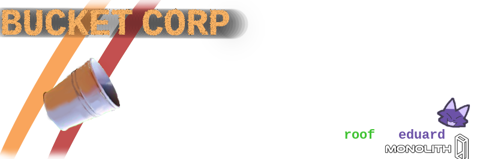

  

## intro
hai hello this is mainly existant as a private server while we endorse messinga round with this and running your own this is mainly made for personal use and we will not take critistism or suggestions unless if we really like em

## main things to note

this server is very fucked up having an .db file in its main folder as that is its permision database after you build this server i strongly recommend putting in "\bin\Content.Server\data" after building and overwriteing the old one as the .bat file and .sh files for building do not put those automaticly yet

## Contributing

no

## Building

Refer to [the Space Wizards' guide](https://docs.spacestation14.com/en/general-development/setup/setting-up-a-development-environment.html) on setting up a development environment for general information, but keep in mind that Einstein Engines is not the same and many things may not apply.
We provide some scripts shown below to make the job easier.

### Build dependencies

> - Git
> - .NET SDK 10.0

### Windows

> 1. Clone this repository
> 2. Run `Scripts/bat/updateEngine.bat` in a terminal or in file explorer to download the engine
> 3. Run `Scripts/bat/buildAllDebug.bat` after making any changes to the source
> 4. Run `Scripts/bat/runQuickAll.bat` to launch the client and the server
> 5. Connect to localhost in the client and play

### Linux

> 1. Clone this repository
> 2. Run `Scripts/sh/updateEngine.sh` in a terminal to download the engine
> 3. Run `Scripts/sh/buildAllDebug.sh` after making any changes to the source
> 4. Run `Scripts/sh/runQuickAll.sh` to launch the client and the server
> 5. Connect to localhost in the client and play

### MacOS

> 1. Clone this repository
> 2. Run `Scripts/sh/updateEngine.sh` in a terminal to download the engine
> 3. Run `Scripts/sh/buildAllDebug.sh` after making any changes to the source
> 4. Run `Scripts/sh/runQuickAll.sh` to launch the client and the server
> 5. Connect to localhost in the client and play

